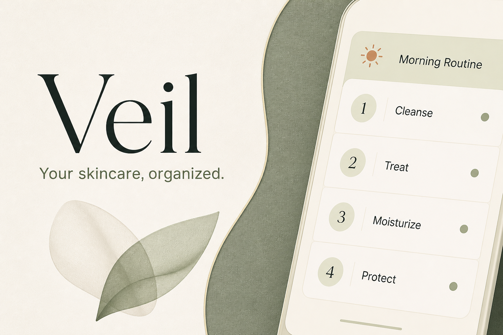

# Veil

**Your skincare, organized.** Veil is a private, account-free skincare routine tracker designed first for iPhone. It answers the daily question “What should I do right now?” while keeping routines, products, history, notes, observations, and compressed photos in the browser that created them.



## Product overview

Veil is a complete installable Progressive Web App with five primary areas:

- **Today** selects the appropriate AM or PM routine, persists every completed or skipped step immediately, shows personal compatibility reminders, and captures quick notes.
- **Routines** creates, edits, duplicates, favorites, archives, schedules, and reorders routines and their steps with touch- and keyboard-accessible controls.
- **Products** manages the full product lifecycle, custom categories, favorites, local photos, opened and printed-expiration dates, and clearly separated period-after-opening guidance.
- **Progress** combines routine history, a journal, local progress photos with comparison, and neutral observation logs that never claim causation.
- **More** provides global search, theme and routine timing preferences, personal incompatibility reminders, storage reporting, guarded ZIP backup/restore, installation guidance, privacy details, and destructive-data protection.

The production database begins empty except for built-in category names and preferences. Onboarding can create two generic routines at the user’s request; it never inserts fake products, history, photos, or sample skincare data.

## Architecture

Veil is intentionally client-only and local-first:

```text
React screens and reusable UI
             ↓
Feature hooks and application services
             ↓
Typed repositories
             ↓
Dexie → IndexedDB in the current browser
```

- **Runtime:** React 19, strict TypeScript, vinext/Vite.
- **Persistence:** Dexie over IndexedDB for durable records and image blobs; `localStorage` only for the theme and first-launch flag.
- **Navigation:** a lightweight URL-aware app router keeps browser history and shareable primary-view URLs without requiring server navigation.
- **Styling:** authored CSS with semantic tokens, light/dark/system themes, reduced motion, safe-area insets, 44 px controls, narrow-phone support, and a centered desktop shell.
- **Offline:** a local service worker caches the application shell and same-origin static assets. IndexedDB-backed workflows remain available after the first successful load.
- **Media:** selected images are decoded, resized, compressed, thumbnailed, and stored as blobs. Object URLs are revoked when no longer needed.
- **Resilience:** loading, empty, validation, quota, database, backup, and top-level render failures have user-facing states; secondary screens are lazy loaded.
- **Privacy:** there is no Veil backend, remote data API, account database, analytics SDK, cloud sync, or medical decision engine.

See [docs/architecture.md](./docs/architecture.md) for dependency boundaries, persistence operations, scheduling, and restore semantics.

## Data schema

`VeilDatabase` currently declares schema version 1 with these tables:

| Table | Purpose | Important indexes |
| --- | --- | --- |
| `products` | Product identity, use constraints, dates, status, favorites, and photo reference | category, status, favorite, photo, updated time |
| `routines` | Named AM, PM, or anytime routines | period, favorite, archive state, priority |
| `routineSteps` | Ordered routine instructions and optional product links | routine and compound routine/order |
| `routineSchedules` | Daily, weekday, interval, or manual activation | routine, kind, enabled |
| `routineSessions` | Durable per-day routine history and progress totals | date, compound date/period, status |
| `sessionSteps` | Immutable step and product snapshots | session, compound session/order, state |
| `quickNotes` | Timestamped notes from Today | local date, capture time, session |
| `journalEntries` | Skin-feel journal, tags, notes, photos, and product context | date, capture time, multi-entry tags/products |
| `progressPhotos` | Dated progress-photo metadata | date, capture time, media, tags |
| `reactionLogs` | Neutral observations with severity and product context | date, capture time, type, products |
| `categories` | Built-in and custom product categories | unique name, built-in flag, order |
| `incompatibilities` | User-authored product or routine-step reminders | pair members and compound pair |
| `media` | Compressed full images, thumbnails, dimensions, type, and size | purpose, creation time |
| `preferences` | Routine boundaries and application defaults | singleton ID |

Every entity uses a UUID string and ISO timestamps. Historical sessions store routine, step, and product-name snapshots so old history remains intelligible after source records change. Missing optional relationships are tolerated rather than corrupting a view.

### Repository pattern

Components do not perform arbitrary database mutations. Repositories own entity validation, timestamps, sorting, relationship cleanup, and transactions. Services coordinate cross-table behavior such as schedule selection, session completion, image processing, search, storage estimates, and backup/restore. Dexie live queries subscribe screens only to the data they display.

When changing the schema, add a new Dexie `version(n).stores(...)` declaration in `src/db/VeilDatabase.ts`; never rewrite version 1 for an already shipped database. Put required transforms in an idempotent `upgrade()` callback and add a fake-IndexedDB migration test.

## Local development

### Requirements

- Node.js 22.13 or newer
- npm 10 or newer
- A modern browser with IndexedDB (Safari is recommended for final iPhone testing)

### Install and run

```bash
git clone https://github.com/AntoniRom17/Veil.git
cd Veil
npm install
npm run dev
```

Open `http://localhost:3000`. No environment variables, API keys, database server, or account setup are required.

### Commands

```bash
npm run dev           # local vinext development server
npm run typecheck     # strict TypeScript validation
npm run lint          # ESLint, React hooks, and accessibility rules
npm test              # unit and integration test suite
npm run test:watch    # interactive Vitest mode
npm run test:coverage # coverage report
npm run build         # production build
npm run test:smoke    # rendered production metadata/PWA smoke test
npm run build:netlify # Netlify-compatible Nitro build
npm run test:netlify  # verify generated Netlify function and PWA assets
npm run check         # complete Cloudflare/Sites and Netlify release gate
npm start             # serve an existing production build
```

Tests use Vitest, Testing Library, jsdom, and `fake-indexeddb`; they never touch a developer’s real Veil database.

## PWA and offline behavior

`public/manifest.webmanifest` defines the standalone experience, local icons, theme colors, shortcuts, and portrait-oriented branding. `public/sw.js` precaches the root, manifest, and primary icons, then uses:

- network-first navigation with the cached root as an offline fallback;
- stale-while-revalidate for cached scripts, styles, fonts, and images;
- versioned cache cleanup during activation.

The service worker registers only in production. Run `npm run build && npm start` to test install and offline behavior; development intentionally stays uncached so edits are never hidden behind a stale worker.

The application remains local-first while offline: products, routines, routine completion, history, journal entries, photos, observations, search, preferences, and backup creation operate against IndexedDB. A first successful online load is required to cache the app shell. Clearing site data, private browsing, browser eviction, or uninstalling the PWA can remove local records, so keep current backups.

### Install on iPhone

1. Open the deployed Veil site in Safari.
2. Tap **Share**.
3. Choose **Add to Home Screen**.
4. Tap **Add**.

Veil uses `viewport-fit=cover`, iOS standalone metadata, an Apple touch icon, safe-area insets for the notch/Dynamic Island and Home indicator, and input sizing that avoids unwanted form zoom.

## Deploying to Netlify

Veil keeps its native Cloudflare/Sites build and provides an independent Netlify target through Nitro. Connect this repository to Netlify and deploy from `main`. The committed `netlify.toml` is authoritative and configures:

- build command: `npm run build:netlify`;
- publish directory: `dist`;
- Node.js 22.13;
- a Nitro-generated Netlify function that handles `/` and other server-rendered routes while allowing generated static assets to be served directly.

No Netlify environment variables are required. If the existing Netlify project previously had `npm run build`, `vinext build`, `public`, or another publish directory configured in the dashboard, trigger a fresh deploy after pulling this commit. File-based `netlify.toml` settings override the conflicting dashboard build and publish settings.

To validate the exact Netlify artifact locally:

```bash
npm run check:netlify
```

The output is split between `dist/` for public assets and `.netlify/functions-internal/` for the server function. Both folders are generated and intentionally ignored by Git; Netlify creates them during each deploy.

## Backup and restore

In **More → Backup & restore**, export creates `veil-backup-YYYY-MM-DD.zip`:

```text
metadata.json
data.json
images/product/<media-id>.<ext>
images/product/<media-id>-thumbnail.<ext>
images/journal/<media-id>.<ext>
images/journal/<media-id>-thumbnail.<ext>
images/progress/<media-id>.<ext>
images/progress/<media-id>-thumbnail.<ext>
```

`metadata.json` records the app, app version, database schema version, backup-format version, and creation time. `data.json` contains JSON-safe table records and media descriptors; image blobs remain separate.

Before any write, import parses the archive in memory and rejects unreadable ZIPs, unsafe paths, wrong applications, unsupported versions, invalid core arrays, malformed media descriptors, and missing image files. The review screen shows counts and creation details.

- **Merge safely** imports records whose IDs do not already exist and reports skipped collisions. Existing records win.
- **Replace existing** clears Veil tables only inside the same final restore transaction, then writes the validated backup.

A validation failure never mutates current data. Replace requires an explicit destructive confirmation. Keep copies outside the browser if the data matters to you.

## Privacy and safety

Skincare data is stored in the current browser’s IndexedDB. Veil does not upload it to a Veil server and does not include telemetry, advertising trackers, account identity, or cloud synchronization. Data leaves the browser only through an action the user initiates, such as downloading a backup or using browser/OS file sharing.

Veil is an organizational and personal tracking tool. Compatibility reminders are written by the user, and observations use neutral language. The app does not diagnose conditions, determine product safety, recommend treatment, or replace professional medical advice.

## Git workflow

Development uses conventional, small, non-empty commits on `main`. The release history deliberately separates foundation, design system, persistence, feature slices, PWA assets, accessibility, responsive polish, tests, performance, and documentation so changes are reviewable and reversible.

Before publishing:

```bash
npm run check
git status --short
git log --oneline --decorate -10
git remote -v
```

The expected sole remote is `origin` at `https://github.com/AntoniRom17/Veil.git`.

## Known limitations

- Data is browser- and origin-specific; there is no automatic sync between devices or browsers.
- iOS and other browsers can evict local storage under device pressure. Backups are the recovery mechanism.
- Install/offline behavior requires a secure deployed origin (or localhost) and one successful initial load.
- Progress comparison is visual and intentionally avoids automated skin analysis or medical interpretation.
- Merge restore is conservative: identical IDs are skipped instead of attempting to reconcile divergent record contents.
- The initial schema is version 1; the migration convention is established but no historical production migration is needed yet.

## Future improvements

- Optional encrypted, user-controlled cross-device backup without changing the account-free default.
- Richer routine templates that are explicitly chosen rather than automatically seeded.
- More comparison layouts and exportable progress summaries without automated diagnosis.
- Additional accessibility testing with VoiceOver on physical iPhones.
- Versioned IndexedDB migrations as the domain evolves.

## License

This repository is private-source unless its owner adds an explicit license. No permission to copy, modify, or redistribute is granted by default.
